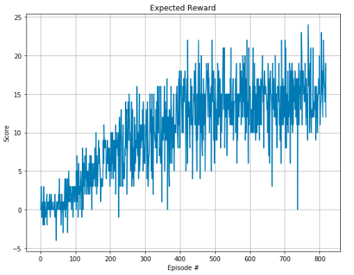

#  Project Report

## Implementation

###  Learning Algorithm  
Deep Q Networks are used to solve this problem which are the combination of Q-Learning and deep neural networks based action values.  
The neural network contains two hidden layers of size 64 - which are fully connected to the output layer of size 4 (action values). ReLU activation function is used for the hidden layers.  

Following hyperparameters are used for learning:  
~~~
BUFFER_SIZE = int(1e5)  # replay buffer size
BATCH_SIZE = 64         # minibatch size
GAMMA = 0.99            # discount factor
TAU = 1e-3              # for soft update of target parameters
LR = 5e-4               # learning rate 
UPDATE_EVERY = 4        # how often to update the network
~~~

##  Plot of Rewards
  
Environment solved in 719 episodes with an average score of 15.00

##  Ideas for Future Work  
- Hyper parameters and different network architures can be explored further to improve the agent's learning speed.
- Other methods can also be implemented i.e.prioritized experience replay, Double DQN, or Dueling DQN.
